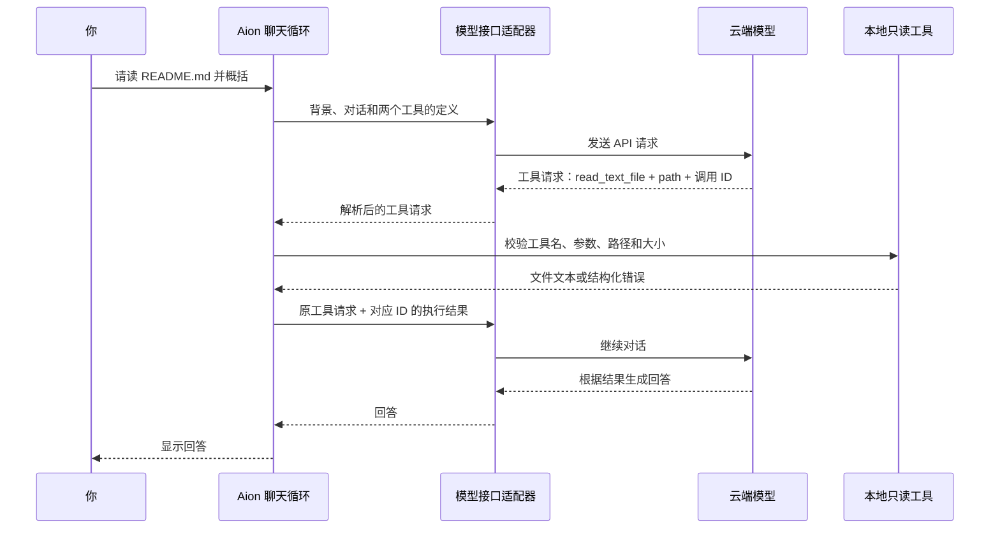

# Personal AI Network

This repository is for building my Personal AI Network: a connected system for learning, creating, organizing knowledge, and automating workflows with AI.

## Current Goal

Learn how to combine ChatGPT, Codex, GitHub, Skills, and future automations into one practical personal system.

## Current Stage

**Aion v0.3** — 本地会话保存与恢复、每轮工具执行事实。v0.2 已由用户确认真实列目录和读 README 成功；v0.3 已通过离线测试，实际对话效果待试用。

## 运行

Python 3.9+，只用标准库，无需安装依赖。目前文件工具使用 macOS / Linux 的文件描述符接口，不支持 Windows。

```bash
cd ~/Documents/AI/personal-ai
python3 aion.py --check
python3 aion.py
```

程序显示服务、模型、启动文件和工具范围，再提示隐藏输入 API key。默认使用 DeepSeek，也可以读取 `DEEPSEEK_API_KEY`，不自动读取 `.env`。密钥不保存到文件，请勿贴入普通聊天或写进代码。API 单独按用量计费，需要服务商的密钥和余额。

- `/exit`、Ctrl+C、Ctrl+D：退出。
- `/clear`：清空当前上下文并开始新会话；保留旧存档，不重读启动配置。
- 空行：不发请求。
- `--model 模型名`：临时覆盖配置的模型。
- `--resume`：恢复最近启动并保存的会话，继续后保存到新的会话文件。
- `--no-save`：本次不保存聊天，可与 `--resume` 配合。

## v0.2 的两个工具

| 工具 | 用途 | 限制 |
| --- | --- | --- |
| `list_directory` | 列出指定目录一层条目 | 最多返回 100 项，不递归；最多检查 1000 项，结果注明是否截断 |
| `read_text_file` | 读取指定 UTF-8 文本文件 | 最多 16000 字节；超限或非文本直接拒绝 |

路径相对于 `personal-ai`，用 `.` 表示根目录。`aion.json` 的 `tools.allowed_paths` 明确开放哪些文件或子目录；开放目录包含其后代。根目录列表只展示可访问入口，隐藏文件、常见密钥路径和符号链接会被过滤。

默认开放项目说明、程序代码、配置及 `skills/`、`context/`、`rules/`、`tests/`。代码会拒绝绝对路径、`..`、符号链接、硬链接读取、特殊文件及常见秘密文件名。权限判断在 Python 中执行，模型不能通过工具参数改变范围。模型没有写文件、删除或任意 shell 工具。程序自身仅为会话存档写入专用本地目录。

这是一层明确的文件范围控制，不是秘密内容识别器：不要把密钥或私人信息放入已开放的普通文本文件。工具返回内容会发送给配置的模型服务，终端会显示每次读取及成功或失败。

## Tool calling 的数据流



模型只提出函数名和 JSON 参数，Python 才执行读取。工具结果使用对应的 `tool_call_id` 交回模型；需要时可先列目录、再读文件。普通聊天可以直接回答，无需调用工具。

每个问题最多执行 4 轮、共 8 次工具调用，之后允许模型返回最终文字；继续索取工具则停止。模型请求不存在的工具、越界路径或错误参数时，会收到结构化错误。API 失败或达到上限时，本轮对话不加入历史；已经完成的只读操作不会被“撤回”。不自动重试。

## 文件分工与服务商切换

- `aion.py`：终端入口，读取启动配置与密钥。
- `chat_loop.py`：推进对话和工具调用，不绑定服务商。
- `file_tools.py`：两个工具的定义、路径权限和本地执行，不依赖模型接口。
- `providers.py`：将统一消息与工具定义转换成 Chat Completions 请求，解析服务端返回。
- `aion.json`：启动背景名单、服务设置和工具开放路径，无密钥。
- `sessions.py`：仅由终端程序使用的会话存档逻辑，不是模型工具。

当前适配器支持提供 function tool calling 的 Chat Completions 兼容服务。修改 `provider.endpoint`、`model`、`api_key_env`、`name` 即可切换；如使用模型环境变量，也修改 `model_env`。不要把密钥放到配置中，端点必须是 HTTPS，程序拒绝重定向。

`extra_body` 存放服务商特有选项。默认 DeepSeek 使用 `{"thinking":{"type":"disabled"}}`；换到不支持此选项的服务时设为 `{}`。服务商无关不代表所有 API 格式都能直接接入：其他格式需要增加适配器，实现 `complete(messages, tools)`，文件工具与聊天循环可以复用。

接口参考：[DeepSeek Chat Completions](https://api-docs.deepseek.com/api/create-chat-completion/)。默认模型 `deepseek-v4-flash`，密钥可在 [DeepSeek 平台](https://platform.deepseek.com/) 创建。

## 背景、进度与交流

启动时只读取 `aion.json` 的 `files` 名单。`skills/natural-conversation/SKILL.md` 指导自然、适量的交流，`context/aion-progress.md` 是里程碑快照。实际文件信息可以按需工具读取；工具读取文本不会自动替换启动时的规则，也不授予新的权限。

进度应按实质里程碑更新，长期目标在方向改变时更新。Aion 只能起草修改；由用户或有写入能力的助手按 `rules/context-policy.md` 保存。它不会自动维护 context。

默认每轮成功回复后保存聊天及工具历史到 `.aion/sessions/`；使用 `--no-save` 时只留在内存。后续请求会携带当前历史，长聊可以用 `/clear` 开始新会话。文件内容作为资料处理，不能覆盖用户指令或工具权限。本地存档与云端保留政策不同。

语气仍有优化空间。v0.3 每次请求附带程序生成的运行时间和本轮工具结果摘要（成功/失败、路径、目录条目数量）。这些事实不写回 context、不持久化为 system 消息；恢复的旧工具结果明确属于历史。仍需实际试用判断模型能否正确利用事实。

## 验证

```bash
python3 -B -m unittest discover -s tests -v
```

离线测试覆盖实际文件读取、目录限制、越界和链接拦截、秘密路径、大小和文本判断、工具循环、批量调用、异常与上限，以及独立的服务商接口适配。测试使用临时文件和模拟响应，不消耗 API 额度。

重启后可依次尝试：

1. “列出项目根目录里你能访问的内容。”
2. “读取 README.md，告诉我 v0.2 的两个工具有什么限制。”
3. “读取 ../ 的文件。”——若模型尝试调用，程序必须拒绝。

前两项应看到 `[只读工具]` 记录，再收到基于结果的回答。配置加载和离线模拟通过不代表真实模型工具调用已经验证。


## 保存、恢复与当前事实（v0.3）

成功回复后，程序自动保存一份本次会话快照。新启动默认新会话；退出后想接着聊：

```bash
python3 aion.py --resume
```

启动时显示恢复消息数量、存档时间及当前服务。恢复包含过去的用户消息、助手回复和工具结果；继续发送消息时，这些内容会一起交给当前配置的服务商。不会恢复旧的 system 指令，启动背景仍从当前配置重新读取。

存档路径为 `.aion/sessions/时间-随机编号.json`，Git 忽略整个 `.aion/`，模型文件工具拒绝访问隐藏目录。新建目录权限为 700、文件为 600，仅当前用户可读写。存档是本地明文，不是加密保险箱。程序不序列化密钥或服务配置，并遮蔽消息中出现的当前 API key 及常见 sk- 密钥文本；这不是通用敏感信息识别器。

每次启动（含恢复）使用新文件，旧文件保留；本次运行内每个成功回合以原子替换更新快照。`/clear` 保留旧存档但开始新会话。失败回合不保存，单份存档超过 2 MB 或磁盘失败时会明确提示“会话未保存”，当前聊天仍可继续。损坏的存档不会被静默覆盖。没有自动删档功能，需要清理时在 Finder 中显示隐藏文件后由用户管理。

只想临时聊、不保存：

```bash
python3 aion.py --no-save
```

这里的“当前事实”是每轮自动生成的工具执行记录，不是持续监控磁盘，也不自动修改个人目标。文件变化仍需再次调用读取工具，长期 context 按里程碑确认更新。

可先说“这次我们在验证会话恢复”，收到回复后 `/exit`，用 `--resume` 再问“刚才我们在验证什么？”；然后请求列目录和读 README，查看它能否承认本轮已经完成的操作。
